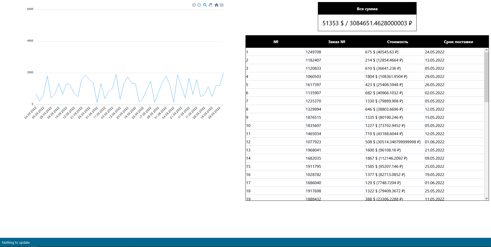

# Preview



# How to run

ATTENTION: Before doing this, make sure that the `udtw-server` is running!

```
npm install
npm run start
```

# Environment variables

|Name|Type|Default|Description|
|-|-|-|-|
|`REACT_APP_API_URL`|`str`|`http://localhost:5000`|`udtw-server` ip address.|
|`REACT_APP_TARGET_ID`|`str`|`1DwfUKQ1jbBkMW-dPr1jRsYY-SifQDwUKqscXr67lCPk`|ID of checking spreadsheet.|
|`REACT_APP_UPDATE_INTERVAL_IN_MS`|`int`|`1000`|Interval after which the client will request data update.|
